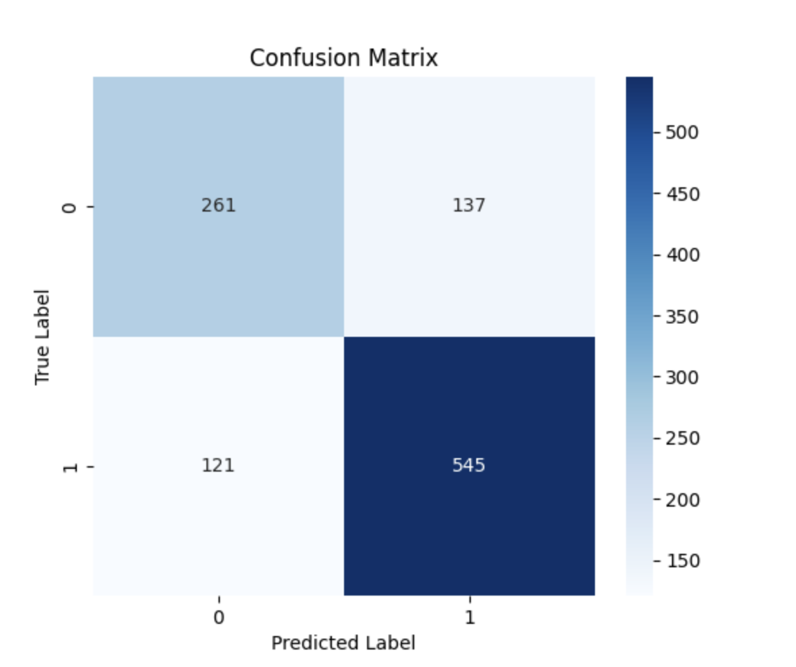
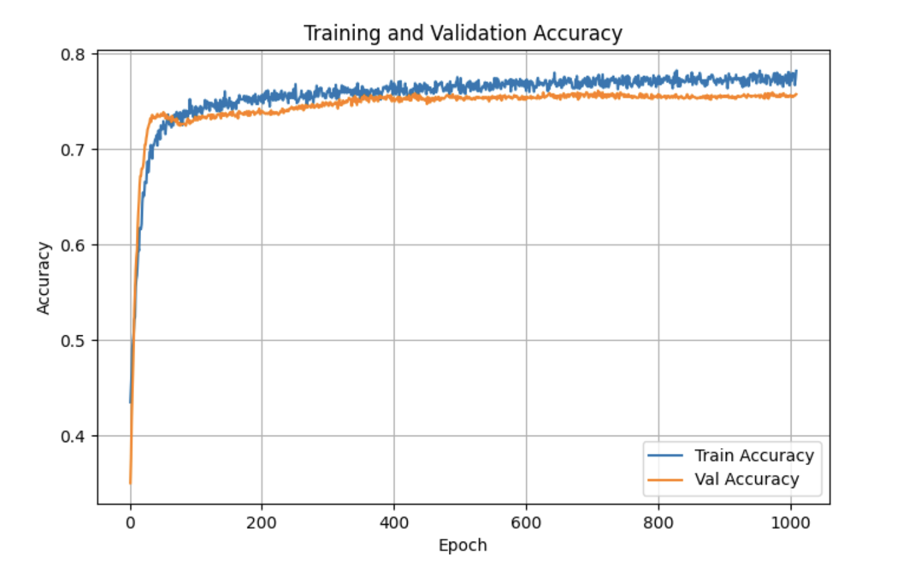
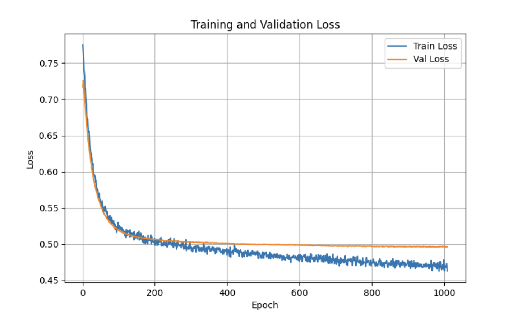
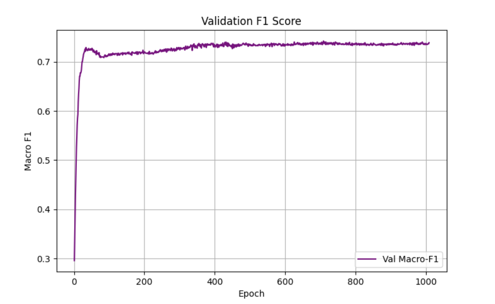

# 
## 模型参数
```Python
nn_in = 14 #输入维度
nn_out = 2 #输出维度
epochs = 5000 #epoch 轮数
nn_neural = 128 #hidden layer神经元数量
batch_train = 256 #训练集batch
batch_val = 32#验证集batch
lr = 1e-5#学习率
```
## DNN 结构
```Python
model = nn.Sequential(
#input layer
    nn.Linear(nn_in, nn_neural),
    #LL1归一化，减少过拟合
    nn.BatchNorm1d(nn_neural),
    #relu（）激活函数
    nn.ReLU(),
    nn.Dropout(0.2),
    #hidden layer1
    nn.Linear(nn_neural, nn_neural),
    nn.BatchNorm1d(nn_neural),
    nn.ReLU(),
    nn.Dropout(0.2),
    #hidden layer2
    nn.Linear(nn_neural, nn_neural),
    nn.BatchNorm1d(nn_neural),
    nn.ReLU(),
    nn.Dropout(0.2),
    #output layer
    nn.Linear(nn_neural, nn_out),
)
criterion = nn.CrossEntropyLoss() #loss计算函数，交叉熵函数
optimizer = torch.optim.Adam(model.parameters(), lr=lr，weight_decay=5e-4)#学习率变化的优化器
```
## early stop
如果accuracy在300轮中没有上升，就停止训练
## 训练结果
```Python
The Validation Accuracy is:  0.7575187969924813
The Confusion Matrix is: 
 [[261 137]
 [121 545]] 

The Precision is:  0.7991202346041055
The Recall is:  0.8183183183183184
The F1 is:  0.8086053412462908
```




